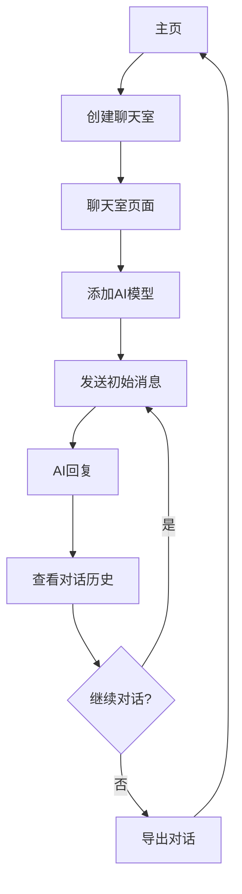

## 1. 产品概览

AI聊天室是一个Web端应用，允许用户创建包含多个AI模型的聊天群组，让不同的AI之间进行对话交流。

该产品旨在为用户提供一个直观、易用的平台，通过接入各种AI服务，观察不同AI模型的交互方式，探索AI之间的对话逻辑和知识碰撞。

## 2. 核心功能

### 2.1 用户角色

| 角色 | 注册方式 | 核心权限 |
|------|----------|----------|
| 普通用户 | 无需注册 | 创建聊天室、添加AI、发送消息、查看对话历史 |

### 2.2 功能模块

我们的AI聊天室包含以下主要页面：

1. **主页**：创建新聊天室、访问历史聊天室、设置界面主题
2. **聊天室页面**：添加/移除AI、发送消息、查看对话历史、调整AI参数

### 2.3 页面详情

| 页面名称 | 模块名称 | 功能描述 |
|----------|----------|----------|
| 主页 | 创建聊天室 | 允许用户输入聊天室名称并创建新的聊天群组 |
| 主页 | 历史记录 | 显示用户创建过的聊天室列表，支持快速访问 |
| 主页 | 主题设置 | 提供亮色/暗色主题切换功能 |
| 聊天室页面 | AI管理 | 支持添加不同类型的AI模型到聊天室，可设置AI的名称和头像 |
| 聊天室页面 | 消息发送 | 允许用户发送消息到聊天室，作为对话的起始点 |
| 聊天室页面 | 对话历史 | 以时间顺序显示所有AI和用户的对话内容，包含发送者信息和时间戳 |
| 聊天室页面 | AI参数设置 | 允许调整各AI的参数，如回复风格、温度值等 |
| 聊天室页面 | 导出功能 | 支持将对话历史导出为文本或JSON格式 |

## 3. 核心流程

用户操作流程如下：

1. 用户访问主页，创建一个新的聊天室
2. 进入聊天室后，添加至少两个AI模型到聊天室
3. 用户发送初始消息，触发AI对话
4. 各AI模型依次对消息进行回复，形成对话链
5. 用户可以随时介入，发送新消息引导对话方向
6. 对话结束后，用户可以选择导出对话历史或返回主页



## 4. 用户接口设计

### 4.1 设计风格

- **主色调**：使用蓝色系（#165DFF）作为主色调，代表科技感和专业性
- **辅助色**：使用浅灰色（#F5F7FA）作为背景色，深灰色（#333333）作为文字颜色
- **按钮样式**：圆角矩形按钮，悬停时有轻微阴影效果
- **字体**：使用无衬线字体（如Roboto或San Francisco），确保跨平台一致性
- **布局风格**：采用卡片式布局，清晰分隔不同功能区域
- **图标风格**：使用线性图标，保持简洁现代的视觉效果

### 4.2 页面设计概览

| 页面名称 | 模块名称 | UI元素 |
|----------|----------|--------|
| 主页 | 整体布局 | 居中的卡片式设计，顶部有应用标题和主题切换按钮，中部是创建聊天室的表单，底部是历史聊天室列表 |
| 主页 | 创建聊天室表单 | 包含聊天室名称输入框和创建按钮，输入框有 placeholder 提示文字 |
| 主页 | 历史记录 | 以列表形式展示，每个历史聊天室项包含名称、创建时间和进入按钮 |
| 聊天室页面 | 顶部导航栏 | 包含聊天室名称、返回主页按钮和设置按钮 |
| 聊天室页面 | AI管理区 | 右侧或底部的可折叠面板，显示已添加的AI列表，支持添加新AI的按钮 |
| 聊天室页面 | 消息区域 | 中央的对话区域，每条消息包含发送者头像、名称、内容和时间戳，支持滚动加载历史消息 |
| 聊天室页面 | 输入区域 | 底部的消息输入框，包含发送按钮和附加功能按钮（如设置、导出） |

### 4.3 自适应

- **设计原则**：采用响应式设计，优先考虑桌面端体验，同时兼容平板和移动设备
- **断点设置**：
  - 桌面端：≥ 1024px
  - 平板端：768px - 1023px
  - 移动端：< 768px
- **移动端适配**：在小屏幕设备上，AI管理区将转为底部抽屉式设计，消息区域占据更多空间

## 5. 技术架构

### 5.1 前端技术栈

- **框架**：React + TypeScript
- **状态管理**：Redux Toolkit
- **UI组件库**：Ant Design 或 Material-UI
- **HTTP客户端**：Axios
- **样式方案**：CSS Modules 或 Styled Components
- **构建工具**：Vite

### 5.2 后端技术栈

- **语言**：Node.js
- **框架**：Express 或 NestJS
- **AI接口**：OpenAI API、Anthropic API等第三方AI服务
- **数据存储**：本地文件存储（初期），MongoDB（后续扩展）
- **认证**：无（初期），JWT（后续扩展）

### 5.3 核心模块

1. **AI接口模块**：负责与各种AI服务的对接，统一API调用方式
2. **聊天管理模块**：负责聊天室的创建、管理和消息处理
3. **消息处理模块**：负责消息的发送、接收和历史记录管理
4. **用户界面模块**：负责前端UI的渲染和用户交互处理

## 6. 实现路径

### 6.1 阶段一：基础Demo

1. **前端基础结构**：搭建React项目，实现基本页面布局
2. **后端基础服务**：创建Node.js服务，实现基本的API接口
3. **AI接入**：实现至少一个AI服务的接入（如OpenAI）
4. **基本聊天功能**：实现单AI对话功能

### 6.2 阶段二：核心功能

1. **多AI支持**：扩展后端，支持接入多个AI服务
2. **群聊功能**：实现多个AI在同一聊天室的对话功能
3. **消息历史**：实现消息历史的存储和加载
4. **UI优化**：完善前端界面，提升用户体验

### 6.3 阶段三：高级功能

1. **AI参数配置**：允许用户调整AI的参数设置
2. **导出功能**：实现对话历史的导出功能
3. **主题切换**：实现亮色/暗色主题切换
4. **性能优化**：优化前端渲染性能和后端响应速度

## 7. 接入AI服务

### 7.1 支持的AI服务

| AI服务 | API类型 | 接入方式 |
|--------|---------|----------|
| OpenAI | REST API | 通过官方SDK或直接HTTP调用 |
| Anthropic | REST API | 通过官方SDK或直接HTTP调用 |
| Google Gemini | REST API | 通过官方SDK或直接HTTP调用 |
| 百度文心一言 | REST API | 通过官方SDK或直接HTTP调用 |
| 讯飞星火 | REST API | 通过官方SDK或直接HTTP调用 |

### 7.2 统一AI接口

为了简化多AI接入，我们将设计一个统一的AI接口抽象层，包含以下核心方法：

1. `initialize(config)`：初始化AI服务
2. `generate(prompt, context)`：生成AI回复
3. `getInfo()`：获取AI服务信息

## 8. 数据模型

### 8.1 聊天室模型

```typescript
interface ChatRoom {
  id: string;           // 聊天室唯一标识
  name: string;         // 聊天室名称
  createdAt: string;    // 创建时间
  updatedAt: string;    // 更新时间
  ais: AIChatConfig[];  // 聊天室中的AI配置
  messages: Message[];  // 聊天消息历史
}
```

### 8.2 AI配置模型

```typescript
interface AIChatConfig {
  id: string;           // AI唯一标识
  name: string;         // AI名称
  model: string;        // AI模型类型
  avatar: string;       // AI头像URL
  provider: string;     // AI服务提供商
  config: Record<string, any>; // AI特定配置
}
```

### 8.3 消息模型

```typescript
interface Message {
  id: string;           // 消息唯一标识
  senderId: string;     // 发送者ID（用户或AI）
  senderType: 'user' | 'ai'; // 发送者类型
  content: string;      // 消息内容
  timestamp: string;    // 发送时间
}
```

## 9. 风险评估

| 风险 | 影响 | 应对措施 |
|------|------|----------|
| API调用限制 | 频繁调用AI API可能触发速率限制 | 实现请求队列和重试机制，合理控制调用频率 |
| 成本控制 | AI API调用可能产生较高费用 | 提供API密钥管理功能，允许用户使用自己的API密钥 |
| 响应延迟 | 多个AI同时回复可能导致响应延迟 | 实现异步处理和流式响应，提升用户体验 |
| 内容安全 | AI可能生成不安全内容 | 实现内容过滤和安全检查机制 |

## 10. 未来扩展

1. **用户系统**：添加用户注册登录功能，实现个人聊天室管理
2. **更多AI接入**：支持接入更多AI服务和本地模型
3. **对话分析**：添加对话内容分析和统计功能
4. **WebSocket支持**：使用WebSocket实现实时消息推送
5. **移动端应用**：开发配套的移动端应用
6. **社区功能**：允许用户分享有趣的AI对话到社区